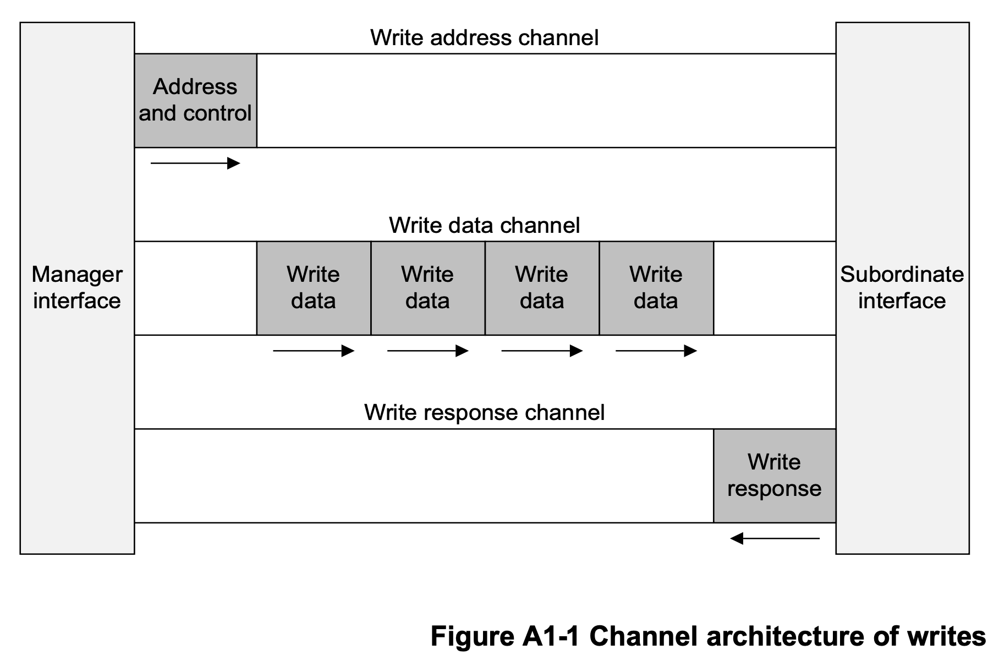
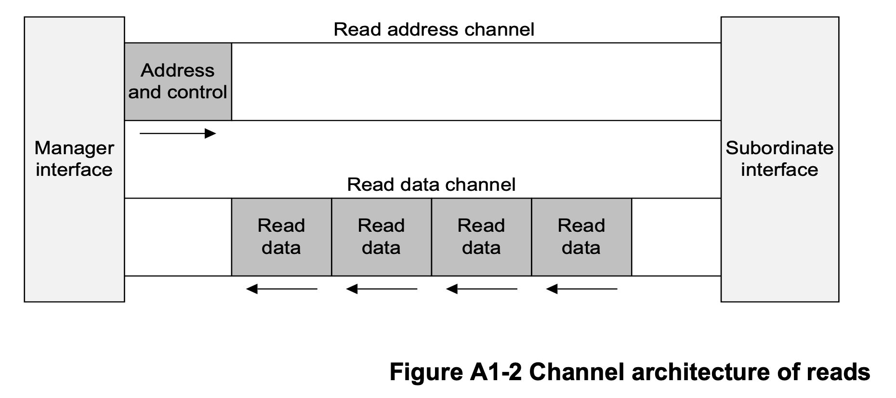
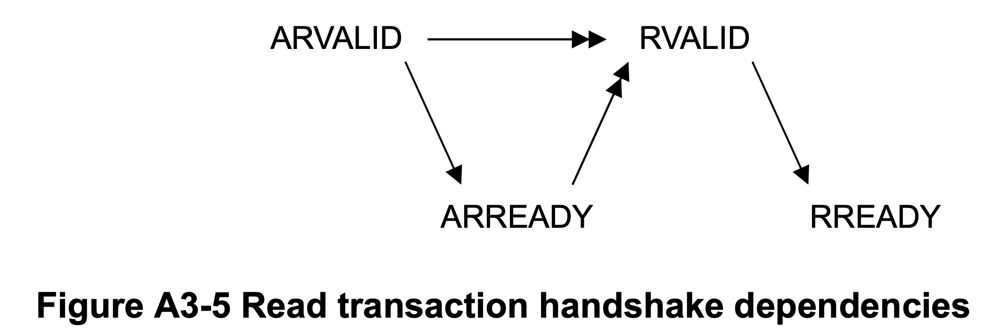
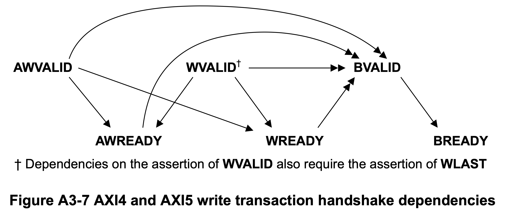

## 1. AXI4 Architecture

The AXI protocol is burst-based and defines five independent transaction channels:

- Read address, which has signal names beginning with **AR**.
- Read data (8, 16, 32, 64, 128, 256, 512, or 1024 bits wide), which has signal names beginning with **R**.
- Write address, which has signal names beginning with **AW**.
- Write data (8, 16, 32, 64, 128, 256, 512, or 1024 bits wide), which has signal names beginning with **W**.
- Write response, which has signal names beginning with **B**.

Each of the five independent channels consists of a set of information signals and **VALID** and **READY** signals that provide a two-way handshake mechanism. Both the read data channel and the write data channel also include a **LAST** signal to indicate the transfer of the final data item in a transaction.

## 2. Signal Descriptions

> About Source column: Manager -> Master, Subordinate -> Slave

### 2.1 Global signals

| Signal      | Bit width | Source       | Description          |
| ----------- | --------- | ------------ | -------------------- |
| **ACLK**    | 1         | Clock source | Global clock signal. |
| **ARESETn** | 1         | Reset source | Global reset signal. |

All signals are sampled on the rising edge of the global clock.

### 2.2 Write address channel signals

| Signal      | Bit width | Source      | Description                                                  |
| ----------- | --------- | ----------- | ------------------------------------------------------------ |
| **AWADDR**  | 32        | Manager     | The address of the first transfer in a write transaction.    |
| **AWLEN**   | 8         | Manager     | Length, the exact number of data transfers in a write transaction. |
| **AWSIZE**  | 3         | Manager     | Size, the number of bytes in each data transfer in a write transaction. |
| **AWBURST** | 2         | Manager     | Burst type, indicates how address changes between each transfer in a write transaction. |
| **AWVALID** | 1         | Manager     | Indicates that the write address channel signals are valid.  |
| **AWREADY** | 1         | Subordinate | Indicates that a transfer on the write address channel can be accepted. |

### 2.3 Write data channel signals

| Signal     | Bit width     | Source      | Description                                                  |
| ---------- | ------------- | ----------- | ------------------------------------------------------------ |
| **WDATA**  | ≤1024         | Manager     | Write data.                                                  |
| **WSTRB**  | WDATA_WIDTH/8 | Manager     | Write strobes, indicate which byte lanes hold valid data.    |
| **WLAST**  | 1             | Manager     | Indicates whether this is the last data transfer in a write transaction. |
| **WVALID** | 1             | Manager     | Indicates that the write data channel signals are valid.     |
| **WREADY** | 1             | Subordinate | Indicates that a transfer on the write data channel can be accepted. |

> **WDATA** can be chosen according to the bandwidth requirement.
>
> Possible value: 8, 16, 32, 64, 128, 256, 512, or 1024.

### 2.4 Write response channel signals

| Signal     | Bit width | Source      | Description                                                  |
| ---------- | --------- | ----------- | ------------------------------------------------------------ |
| **BRESP**  | 2         | Subordinate | Write response, indicates the status of a write transaction. |
| **BVALID** | 1         | Subordinate | Indicates that the write response channel signals are valid. |
| **BREADY** | 1         | Manager     | Indicates that a transfer on the write response channel can be accepted. |

### 2.5 Read address channel signals

| Signal      | Bit width | Source      | Description                                                  |
| ----------- | --------- | ----------- | ------------------------------------------------------------ |
| **ARADDR**  | 32        | Manager     | The address of the first transfer in a read transaction.     |
| **ARLEN**   | 8         | Manager     | Length, the exact number of data transfers in a read transaction. |
| **ARSIZE**  | 3         | Manager     | Size, the number of bytes in each data transfer in a read transaction. |
| **ARBURST** | 2         | Manager     | Burst type, indicates how address changes between each transfer in a read transaction. |
| **ARVALID** | 1         | Manager     | Indicates that the read address channel signals are valid.   |
| **ARREADY** | 1         | Subordinate | Indicates that a transfer on the read address channel can be accepted. |

### 2.6 Read data channel signals

| Signal     | Bit width | Source      | Description                                                  |
| ---------- | --------- | ----------- | ------------------------------------------------------------ |
| **RDATA**  | ≤1024     | Subordinate | Read data.                                                   |
| **RRESP**  | 2         | Subordinate | Read response, indicates the status of a read transfer.      |
| **RLAST**  | 1         | Subordinate | Indicates whether this is the last data transfer in a read transaction. |
| **RVALID** | 1         | Subordinate | Indicates that the read data channel signals are valid.      |
| **RREADY** | 1         | Manager     | Indicates that a transfer on the read data channel can be accepted. |

> **RDATA** can be chosen according to the bandwidth requirement of NPU.
>
> Possible value: 8, 16, 32, 64, 128, 256, 512, or 1024

## 3. Burst in Detail

### 3.1 Definition

In an AXI transaction, the payload data is transferred in a single burst, that can comprise multiple beats, or individual data transfers.

### 3.2 Burst type

| AxBURST[1:0] | Burst type |
| ------------ | ---------- |
| 2'b00        | **FIXED**  |
| 2'b01        | **INCR**   |
| 2'b10        | **WRAP**   |
| 2'b11        | Reserved   |

**AxBURST** indicates **ARBURST** or **AWBURST**.

1. **FIXED**

   In a fixed burst:

   - The address is the same for every transfer in the burst.
   - The byte lanes that are valid are constant for all beats in the burst. However, within those byte lanes, the actual bytes that have **WSTRB** asserted can differ for each beat in the burst.

2. **INCR**

   Incrementing. In an incrementing burst, the address for each transfer in the burst is an increment of the address for the previous transfer. The increment value depends on the size of the transfer. For example, for an aligned start address, the address for each transfer in a burst with a size of 4 bytes is the previous address plus four.

3. **WRAP**

   A wrapping burst is similar to an incrementing burst, except that the address wraps around to a lower address if an upper address limit is reached.

   The following restrictions apply to wrapping bursts:

   - The start address must be aligned to the size of each transfer.
   - The length of the burst must be 2, 4, 8, or 16 transfers.
   
   The behavior of a wrapping burst is:
   
   - The lowest address that is used by the burst is aligned to the total size of the data to be transferred, that is, to ((size of each transfer in the burst) × (number of transfers in the burst)). This address is defined as the *wrap boundary*.
   - After each transfer, the address increments in the same way as for an INCR burst. However, if this incremented address is ((wrap boundary) + (total size of data to be transferred)), then the address wraps round to the wrap boundary.

   - The first transfer in the burst can use an address that is higher than the wrap boundary, subject to the restrictions that apply to wrapping bursts. The address wraps for any WRAP burst when the first address is higher than the wrap boundary.

### 3.3 Burst length

`Burst_Length = AxLEN[7:0] + 1`, **AxLEN** indicates **ARLEN** or **AWLEN**.

AXI4 extends burst length support for the INCR burst type to 1-256 transfers. Support for all other burst types in AXI4 remains at 1-16 transfers.

AXI has the following rules governing the use of bursts:

- For wrapping bursts, the burst length must be 2, 4, 8, or 16.
- A burst must not cross a 4KB address boundary.
- Early termination of bursts is not supported.

### 3.4 Burst size

`Bytes_in_one_transfer = (1 << AxSIZE[2:0])`, **AxSIZE** indicates **ARSIZE** or **AWSIZE**.

The size of any transfer must not exceed the data bus width of either agent in the transaction.

## 4. Read and Write Response

| RRESP[1:0] / BRESP[1:0] | Response   |
| ----------------------- | ---------- |
| 2'b00                   | **OKAY**   |
| 2'b01                   | **EXOKAY** |
| 2'b10                   | **SLVERR** |
| 2'b11                   | **DECERR** |

1. **OKAY, normal access success**

   An OKAY response indicates any one of the following:

   - The success of a normal access.
   - ~~The failure of an exclusive access.~~ **(We won't meet such case.)**
   - ~~An exclusive access to a Subordinate that does not support exclusive access.~~ **(We won't meet such case.)**

2. ~~**EXOKAY, exclusive access success**~~ **(We won't meet such case.)**

   An EXOKAY response indicates the success of an exclusive access. This response can only be given as the response to an exclusive read or write.

3. **SLVERR, Subordinate error**

   The SLVERR response indicates an unsuccessful transaction.

   To simplify system monitoring and debugging, this specification recommends that error responses are used only for error conditions and not for signaling normal, expected events. Examples of Subordinate error conditions are:

   - FIFO or buffer overrun or underrun condition
   - Unsupported transfer size attempted.
   - Write access attempted to read-only location
   - Timeout condition in the Subordinate
   - Access attempted to a disabled or powered-down function

4. **DECERR, decode error**

   The DECERR response indicates that the interconnect cannot successfully decode a Subordinate access.

   If the interconnect cannot successfully decode a Subordinate access, it must return the DECERR response. This specification recommends that the interconnect routes the access to a default Subordinate, and the default Subordinate returns the DECERR response.

   The AXI protocol requires that all data transfers for a transaction are completed, even if an error condition occurs. Any component giving a DECERR response must meet this requirement.

## 5. Dependencies between Channel Handshake Signals

In the dependency diagrams:

- Single-headed arrows point to signals that can be asserted before or after the signal at the start of the arrow.
- Double-headed arrows point to signals that must be asserted only after assertion of the signal at the start of the arrow.

### 5.1 Read transaction dependencies

- The Manager must not wait for the Subordinate to assert **ARREADY** before asserting **ARVALID**.
- The Subordinate can wait for **ARVALID** to be asserted before it asserts **ARREADY**.
- The Subordinate can assert **ARREADY** before **ARVALID** is asserted.
- The Subordinate must wait for both **ARVALID** and **ARREADY** to be asserted before it asserts **RVALID** to indicate that valid data is available.
- The Subordinate must not wait for the Manager to assert **RREADY** before asserting **RVALID**.
- The Manager can wait for **RVALID** to be asserted before it asserts **RREADY**.
- The Manager can assert **RREADY** before **RVALID** is asserted.

### 5.2 AXI4 and AXI5 write transaction dependencies

- The Manager must not wait for the Subordinate to assert **AWREADY** or **WREADY** before asserting **AWVALID** or **WVALID**.

- The Subordinate can wait for **AWVALID** or **WVALID**, or both, before asserting **AWREADY**.
- The Subordinate can assert **AWREADY** before **AWVALID** or **WVALID**, or both, are asserted.
- The Subordinate can wait for **AWVALID** or **WVALID**, or both, before asserting **WREADY**.
- The Subordinate can assert **WREADY** before **AWVALID** or **WVALID**, or both, are asserted.
- The Subordinate must wait for **AWVALID**, **AWREADY**, **WVALID**, and **WREADY** to be asserted before asserting **BVALID**.
- The Subordinate must also wait for **WLAST** to be asserted before asserting **BVALID**. This wait is because the write response, **BRESP**, must be signaled only after the last data transfer of a write transaction.
- The Subordinate must not wait for the Manager to assert **BREADY** before asserting **BVALID.** The Manager can wait for **BVALID** before asserting **BREADY.** 
- The Manager can assert **BREADY** before **BVALID** is asserted.

## 6. Reference

[AMBA® AXI and ACE Protocol Specification](https://developer.arm.com/documentation/ihi0022/hc) Part A1~A6

