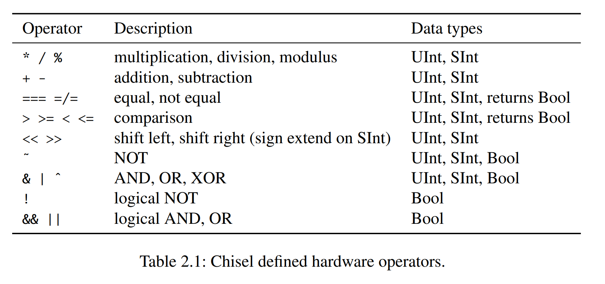

## 介绍

Chisel是一个**硬件构建语言**（Hardware Construct Language），它是Scala的一个库。Chisel的设计目标是利用Scala的强大特性，同时又能够生成高效的硬件描述。Chisel的设计思想是将硬件描述看作是一个函数式的数据结构，这样可以利用Scala的函数式特性来描述硬件。

## 基本组成

### 数据类型

Chisel 有三种数据结构：`Bits`，`UInt` 和 `SInt`。
这三种数据结构都表示一个比特向量（vector of bits）。
`Bits` 是一个抽象类，`UInt` 和 `SInt` 是 `Bits` 的子类。
一般而言，我们不会使用 `Bits`。

```scala
Bits (8.W)      // 8-bit vector of bits
UInt (8.W)      // 8-bit unsigned integer
SInt (10.W)     // 10-bit signed integer
```

Chisel 使用 `Width` 类型来表示比特向量的长度。
`n.W` 将 Scala 整数 `n` 转换为 Chisel 的 `Width` 类型。

如下是一些数据类型实例：

```scala
0.U                 // defines a UInt constant of 0
-3.S                // defines a SInt constant of -3
3.U(4.W)            // An 4-bit constant of 3

"hff".U             // hexadecimal representation of 255
"o377".U            // octal representation of 255
" b1111_1111 ".U    // binary representation of 255, the underscore is ignored
```

！！！注意：定义宽度时不能遗漏 `.W`。 `1.U(32)` 不会定义表示 1 的 32 位宽常量。相反，表达式 (32) 被解释为第32位，这会导致结果是 0。

Chisel 会自动推断常量的宽度，如果没有指定位宽，那么 Chisel 会默认使用能表示该常数的最小位宽。
例如，`3.U` 会被推断为 `3.U(2.W)`，因为 3 可以用 2 位表示。
尽管 Chisel 会推断信号和寄存器所需的位宽，但在创建硬件对象时指定预期的位宽度是一个很好的习惯。

为了表示逻辑值，Chisel 定义了 `Bool` 类型。
以下代码将 Scala 布尔常量 true 和 false 转换为 Chisel `Bool` 常量。

```scala
true.B
false.B
```

### 组合逻辑




```scala
val logic = (a & b) | c
```

该电路可以用于向量，而不仅仅是与 AND 和 OR 电路组合的 Wire。

运算的结果宽度是加法和减法运算符的最大宽度、乘法的两个宽度之和，通常是除法和模运算的分子宽度。

信号也可以首先定义为某种类型的 `Wire`。
之后，我们可以使用 `:=` 更新运算符（update operator）赋值。

```scala
val w = Wire(UInt())
w := a & b
```

数据的截取、拼接、扩展等操作如下：

```scala
val sign = x(31)                    // sign bit of x
val lowByte = largeWord (7, 0)      // low byte of largeWord
val word = highByte ## lowByte      // concatenation, the same as Cat(highByte, lowByte)
```

Chisel 提供了多选器的抽象：

```scala
val result = Mux(sel, a, b)
```

当 `sel`为 `true.B` 时选择 a，否则选择b。`sel` 的类型是 Chisel `Bool`；输入 a 和 b 可以是任何 Chisel 基本类型或聚合（束或向量）（aggregate such as bundles and vectors），只要它们是相同类型即可。

### 寄存器

Chisel 中的寄存器**隐式连接**到全局时钟并在上升沿更新
当在寄存器声明中提供初始化值时，它使用连接到全局复位信号的**同步复位**。

```scala
val reg = RegInit(0.U(8.W))    // 8-bit register, initialized with 0 at reset
reg := d                        // connect an input to the register
val q = reg                     // the output of the register can be used just with the name in an expression
```

也可以在定义寄存器的时候指定其输入：

```scala
val nextReg = RegNext(d)        // register with next value of d
```

同时指定初始值和输入：

```scala
val bothReg = RegNext(d, 0.U)   // register with next value of d, initialized with 0
```

下面是一个计数器实例：

```scala
val cntReg = RegInit (0.U(8.W))
cntReg := Mux(cntReg === 9.U, 0.U, cntReg + 1.U)
```

### Bundle 和 Vec 结构

Chisel 提供了两种聚合（aggregate）数据结构来组织多个信号：`Bundle` 和 `Vec`。
`Bundle` 将不同类型的信号分组为命名字段。
`Vec` 表示相同类型的信号（元素）的可索引集合。

#### Bundle

我们可以定义一个 `Bundle` 类的继承，并将字段列为构造函数块中的 val。
要使用 bundle，我们使用 `new` 创建它并将其封装到 `Wire` 中。
使用`.`符号访问这些字段。

```scala
class Channel() extends Bundle {
    val data     = UInt(32.W)
    val valid    = Bool()
}

val ch    = Wire(new Channel())
ch.data  := 3.U
ch.valid := true.B

val b     = ch.valid

val channel = ch    // A bundle can be referenced as a whole
```

点表示法（dot notation）在面向对象语言中很常见，其中 `x.y` 表示 `x` 是对象的引用，`y` 是该对象的字段。

#### Vec

##### Combinational Vec

`Vec` 是通过调用带有两个参数的构造函数来创建的：元素的数量和元素的类型。Combinational Vec 需要封装成 `Wire`。
通过使用索引访问各个元素，封装在 `Wire` 中的 `Vec` 只是一个多路复用器（multiplexer）。

```scala
val v = Wire(Vec(3, UInt (4.W)))

v(0) := 1.U
v(1) := 3.U
v(2) := 5.U

val index = 1.U(2.W)
val a = v(index)
```

我们可以使用 `VecInit` 设置 `Vec` 的默认值。

```scala
val defVec = VecInit (1.U(3.W), 2.U, 3.U)
val defVecSig = VecInit(d, e, f)
```

##### Register Vec

我们可以使用 `Vec` 来定义寄存器数组。

```scala
val registerFile = Reg(Vec (32, UInt (32.W)))
registerFile(index) := dIn
val dOut = registerFile(index)
```

向量寄存器也可以被初始化。
初始化的值这就是寄存器复位的值。
为了初始化寄存器文件，我们使用带有初始值的 `VecInit`，并将其封装到 `RegInit` 中。

```scala
val initReg = RegInit(VecInit (0.U(3.W), 1.U, 2.U))
val resetVal = initReg(sel)
initReg (0) := d
initReg (1) := e
initReg (2) := f
```

如果我们想将一个寄存器文件的所有元素重置为相同的值（可能是 0），我们可以使用 Scala 序列 `Seq`。
`Seq` 包含一个创建函数 `fill`，用于用相同的值初始化序列。
`VecInit` 可以使用包含 Chisel 类型的 `Seq` 来构造。

```scala
val resetRegFile =
    RegInit(VecInit(Seq.fill (32) (0.U(32.W))))   // 32-bit register file, initialized with 0
val rdRegFile = resetRegFile(sel)
```

#### Bundle 和 Vec 结合

```scala
val vecBundle = Wire(Vec(8, new Channel()))

class BundleVec extends Bundle {
val field  = UInt(8.W)
val vector = Vec(4, UInt(8.W))
}
```

当我们想要一个有复位值的 `Bundle` 类型的寄存器时，我们首先创建该 `Bundle` 的 `Wire`，根据需要设置各个字段，然后将此 `Bundle` 传递给 `RegInit`。

```scala
val initVal    = Wire(new Channel ())
initVal.data  := 0.U
initVal.valid := false.B
val channelReg = RegInit(initVal)
```

！！！注意，部分赋值在 Chisel 中是不允许的。

```scala
val assignWord      = Wire(UInt(16.W))
assignWord (7, 0)  := lowByte           // WRONG!!!
assignWord (15, 8) := highByte          // WRONG!!!
```

在这种情况下，应该使用 `Bundle` 类型。

```scala
val assignWord = Wire(UInt(16.W))

class Split extends Bundle {
val high = UInt (8.W)
val low = UInt (8.W)
}

val split   = Wire(new Split())
split.low  := lowByte
split.high := highByte
assignWord := split.asUInt()    // casting that bundle with asUInt() to a UInt
```

该解决方案的一个缺点是需要知道 `Bundle` 字段以何种顺序合并到单个向量。

### Wire, Reg 和 IO

`UInt`、`SInt` 和 `Bits` 是 Chisel 类型，它们本身并不代表硬件。
将它们封装到 `Wire`、`Reg` 或 `IO` 中才能生成硬件。
`Wire` 代表组合逻辑，`Reg` 代表寄存器（D 触发器的集合），`IO` 代表模块的连接（电路的引脚）。
任何 Chisel 类型都可以封装在 `Wire`、`Reg` 或 `IO` 中。

你可以通过 Scala 不可变变量来创建一个硬件。
使用 Chisel 运算符 `:=` 将值或表达式分配（或重新分配）到 `Wire`、`Reg` 或 `IO`。

```scala
val number = Wire(UInt())
val reg    = Reg(SInt())

number    := 10.U
reg       := value - 3.U
```

请注意 Scala 赋值运算符 “=” 和 Chisel 运算符 “:=” 之间的细微差别。
创建硬件对象（并为其命名）时使用 Scala 的 “=” 运算符，但在为现有硬件对象分配或重新分配值时使用 Chisel 的 “:=” 运算符。

在组合分支逻辑中，可以根据条件分配组合值，但需要在条件的每个分支中分配它们，否则会描述一个锁存器，Chisel 编译器会报错。
最好的办法是在创建 `Wire` 时定义默认值。

```scala
val number = WireDefault (10.U(4.W))
```

## 模块

### Module 类

硬件组件（hardware components）在 Chisel 中称为模块（module）。
每个模块都继承自类 `Module` 并用 `io` 字段表示接口。
接口由 `Bundle` 定义，并被封装在 `IO()` 中。
`Bundle` 中包含表示模块输入和输出端口的字段。
通过将字段封装到 `Input()` 或 `Output()` 中来定义方向。
方向是从模块本身的角度来看的。

```scala
// an adder

class Adder extends Module {
	val io = IO(new Bundle {
		val a = Input(UInt(4.W))
		val b = Input(UInt(4.W))
		val sum = Output(UInt(4.W))
	})

	io.sum := io.a + io.b
}

// a register

class Register extends Module {
	val io = IO(new Bundle {
		val d = Input(UInt (8.W))
		val q = Output(UInt (8.W))
	})

	val reg = RegInit (0.U)
	reg := io.d
	io.q := reg
}
```

由上述加法器和寄存器模块组成的计数器定义如下：

```scala
class Count10 extends Module {
	val io = IO(new Bundle {
		val dout = Output(UInt(8.W))
	})

	val add = Module(new Adder())
	val reg = Module(new Register())

	// the register output
	val count = reg.io.q

	// connect the adder
	add.io.a := 1.U
	add.io.b := count
	val result = add.io.y

	// connect the Mux and the register input
	val next = Mux(count === 9.U, 0.U, result)
	reg.io.d := next

	io.dout := count
}
```

通过使用 `new` 来实例化模块，并将它封装到 `Module()` 中。

### 实用功能

#### switch

`switch` 函数是一个多路选择器，它的行为类似于 `switch` 语句。

```scala
class Alu extends Module {
	val io = IO(new Bundle {
		val a = Input(UInt(16.W))
		val b = Input(UInt(16.W))
		val fn = Input(UInt(2.W))
		val y = Output(UInt(16.W))
	})

	// some default value is needed
	io.y := 0.U

	// The ALU selection
	switch(io.fn) {
	is(0.U) { io.y := io.a + io.b }
	is(1.U) { io.y := io.a - io.b }
	is(2.U) { io.y := io.a | io.b }
	is(3.U) { io.y := io.a & io.b }
	}
}
```

要使用这个功能，我们需要导入一个Chisel包：`import chisel3.util._`

#### Bulk Connections

为了连接具有多个 IO 端口的模块，Chisel 提供了批量连接运算符 `<>`。
Chisel 会将 `io` 字段中名称相同的端口连接起来。
如果没有匹配的名称，那么该端口会悬空。

```scala
class Fetch extends Module {
	val io = IO(new Bundle {
		val instr = Output(UInt(32.W))
		val pc = Output(UInt(32.W))
	})
	// ... Implementation of fetch
}

class Decode extends Module {
	val io = IO(new Bundle {
		val instr = Input(UInt(32.W))
		val pc = Input(UInt(32.W))
		val aluOp = Output(UInt(5.W))
		val regA = Output(UInt(32.W))
		val regB = Output(UInt(32.W))
	})
	// ... Implementation of decode
}

val fetch = Module(new Fetch ())
val decode = Module(new Decode ())

fetch.io <> decode.io
```

我们也可以将子模块的端口与父模块连接。

```scala
io <> execute.io
```

### 内嵌非 Chisel 代码

Verilog 描述的模块可以通过 `ExtModule` 和 `BlackBox` 类内嵌在 Chisel 中。

两者都可以在定义的时候使用 `Map[String, Param]` ，它们在生成的 Verilog 代码中表示模块的参数。

```scala
class BUFGCE extends BlackBox(Map("SIM_DEVICE" -> "7SERIES")) {
	val io = IO(new Bundle {
		val I = Input(Clock())
		val CE = Input(Bool())
		val O = Output(Clock())
	})
}
```

上述代码中的 `Map("SIM_DEVICE" -> "7SERIES")` 生成的 Verilog 代码为 `parameter SIM_DEVICE = "7SERIES"`。

#### ExtModule

`ExtModules` 充当占位符，其生成的 Verilog 代码是模块的实例化（不会生成模块的定义）。
一个常见的例子是使用 `ExtModule` 来表示 FPGA 上的 IP。

#### BlackBox

```scala
class BlackBoxAdderIO extends Bundle {
	val a = Input(UInt(32.W))
	val b = Input(UInt(32.W))
	val cin = Input(Bool())
	val c = Output(UInt(32.W))
	val cout = Output(Bool())
}

class PathBlackBoxAdder extends HasBlackBoxPath {
	val io = IO(new BlackBoxAdderIO)
	addPath("./src/main/resources/ PathBlackBoxAdder.v")
}
```

上述代码中的 `addPath` 函数指定了 Verilog 模块的路径。

注意，`HasBlackBoxPath` 是 `BlackBox` 类的特征（trait），这意味着 `class Example extends BlackBox with HasBlackBoxInline` 等价于 `class Example extends HasBlackBoxInline`.

