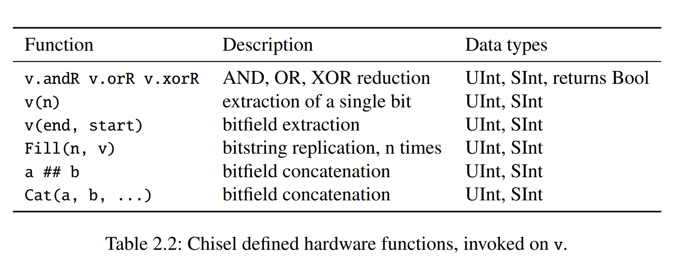

## 介绍

Chisel是一个**硬件构建语言**（Hardware Construct Language），它是 Scala 的一个库。Chisel 的设计目标是利用 Scala 的强大特性，同时又能够生成高效的硬件描述。Chisel 的设计思想是将硬件描述看作是一个函数式的数据结构，这样可以利用 Scala 的函数式特性来描述硬件。

Chisel 教程各个章节的内容如下：

- [基本组成](#基本组成)：基本的数据类型、组合逻辑、寄存器、Bundle 和 Vec 结构、Wire, Reg 和 IO。
- [模块](#模块)：介绍 Module 类。
- [组合逻辑基本模块](#组合逻辑基本模块)：一些简单的组合逻辑模块的实例。
- [时序逻辑基本模块](#时序逻辑基本模块)：一些简单的时序逻辑模块的实例。
- 未完待续。

## 基本组成

### 数据类型

Chisel 有三种数据结构：`Bits`，`UInt` 和 `SInt`。
这三种数据结构都表示一个比特向量（vector of bits）。
`Bits` 是一个抽象类，`UInt` 和 `SInt` 是 `Bits` 的子类。
一般而言，我们不会使用 `Bits`。

```scala
Bits (8.W)      // 8-bit vector of bits
UInt (8.W)      // 8-bit unsigned integer
SInt (10.W)     // 10-bit signed integer
```

Chisel 使用 `Width` 类型来表示比特向量的长度。
`n.W` 将 Scala 整数 `n` 转换为 Chisel 的 `Width` 类型。

如下是一些数据类型实例：

```scala
0.U                 // defines a UInt constant of 0
-3.S                // defines a SInt constant of -3
3.U(4.W)            // a 4-bit constant of 3

"hff".U             // hexadecimal representation of 255
"o377".U            // octal representation of 255
"b1111_1111".U      // binary representation of 255, the underscore is ignored
```

！！！注意：定义宽度时不能遗漏 `.W`。 `1.U(32)` 并不代表 32 位宽的 1。
表达式 `(32)` 被解释为第 32 位，所以 `1.U(32)` 结果是 0。

Chisel 会自动推断常量的位宽，如果没有指定位宽，那么 Chisel 会默认使用能表示该常数的最小位宽。
例如，`3.U` 会被推断为 `3.U(2.W)`，因为 3 可以用 2 位表示。
尽管 Chisel 会推断信号所需的位宽，但在创建硬件对象时指定位宽是一个很好的习惯。

为了表示逻辑值，Chisel 定义了 `Bool` 类型。
以下代码将 Scala 布尔常量 true 和 false 转换为 Chisel `Bool` 常量。

```scala
true.B
false.B
```

### 组合逻辑




```scala
val logic = (a & b) | c
```

该电路描述可以用于向量，而不仅仅是与 AND 和 OR 电路组合的 Wire。

对于加法和减法，运算的结果位宽是源操作数的最大宽度；对于乘法，结果位宽是两个操作数位宽之和；对于除法和取模，通常是分子的位宽。

数据的截取、拼接、扩展等操作如下：

```scala
val sign = x(31)                    // sign bit of x
val lowByte = largeWord(7, 0)       // low byte of largeWord
val word = highByte ## lowByte      // concatenation, the same as Cat(highByte, lowByte)
```

### 寄存器

Chisel 中的寄存器**隐式连接**到全局时钟并在上升沿更新。
如果在声明寄存器时提供了初始化值，它将连接到全局的**同步复位**信号。

```scala
val reg = RegInit(0.U(8.W))     // 8-bit register, initialized with 0 at reset
reg := d                        // connect an input to the register
val q = reg                     // the output of the register can be used just with the name in an expression
```

也可以在定义寄存器的时候指定其输入：

```scala
val nextReg = RegNext(d)        // register with next value of d
```

同时指定初始值和输入：

```scala
val bothReg = RegNext(d, 0.U)   // register with next value of d, initialized with 0
```

具有使能信号的寄存器也很常见，Chisel 的定义如下：

```scala
val resetEnableReg = RegEnable (inVal , 0.U(4.W), enable)
```

第一个参数是输入信号，第二个参数是初始化值，第三个参数是使能信号。

> 有关 `Mux` 的介绍，请参考[多选器](#多选器)。

### Bundle 和 Vec 结构

Chisel 提供了两种聚合（aggregate）数据结构来组织多个信号：`Bundle` 和 `Vec`。
`Bundle` 将不同类型的信号分为一组。
`Vec` 表示相同类型的信号（元素）的可索引集合。

#### Bundle

我们可以定义一个 `Bundle` 类的继承，并使用 `val` 定义不同字段（field）。
要使用 `Bundle`，我们需要用 `new` 创建它并将其封装到 `Wire` 中。
使用`.`符号访问其中的字段。

```scala
class Channel() extends Bundle {
    val data     = UInt(32.W)
    val valid    = Bool()
}

val ch    = Wire(new Channel())
ch.data  := 3.U
ch.valid := true.B

val b     = ch.valid

val channel = ch    // A bundle can be referenced as a whole
```

> 点表示法（dot notation）在面向对象语言中很常见，其中 `x.y` 表示 `x` 是对象的引用，`y` 是该对象的字段。

#### Vec

##### Combinational Vec

`Vec` 是通过调用带有两个参数的构造函数来创建的：元素的数量和元素的类型。Combinational Vec 需要封装成 `Wire`。
通过使用索引访问各个元素，封装在 `Wire` 中的 `Vec` 只是一个多路复用器（multiplexer）。

```scala
val v = Wire(Vec(3, UInt(4.W)))

v(0) := 1.U
v(1) := 3.U
v(2) := 5.U

val index = 1.U(2.W)
val a = v(index)
```

我们可以使用 `VecInit` 设置 `Vec` 的默认值。

```scala
val defVec = VecInit (1.U(3.W), 2.U, 3.U)
val defVecSig = VecInit(d, e, f)
```

##### Register Vec

我们可以使用 `Vec` 来定义寄存器数组。

```scala
val registerFile = Reg(Vec (32, UInt(32.W)))
registerFile(index) := dIn
val dOut = registerFile(index)
```

向量寄存器也可以被初始化。
初始化的值这就是寄存器复位的值。
例如，为了初始化寄存器堆（register file），我们使用带有初始值的 `VecInit`，并将其封装到 `RegInit` 中。

```scala
val initReg = RegInit(VecInit(0.U(3.W), 1.U, 2.U))
val resetVal = initReg(sel)
initReg (0) := d
initReg (1) := e
initReg (2) := f
```

如果我们想将一个寄存器堆所有元素的初始值设为为相同的值，我们可以使用 Scala 序列 `Seq`。
`Seq` 包含一个创建函数 `fill`，它用相同的值初始化序列。
`VecInit` 可以使用包含 Chisel 类型的 `Seq` 来构造。

```scala
val resetRegFile =
    RegInit(VecInit(Seq.fill(32)(0.U(32.W))))   // 32-bit register file, initialized with 0
val rdRegFile = resetRegFile(sel)
```

#### Bundle 和 Vec 结合

```scala
val vecBundle = Wire(Vec(8, new Channel()))

class BundleVec extends Bundle {
val field  = UInt(8.W)
val vector = Vec(4, UInt(8.W))
}
```

当我们想要一个有复位值的 `Bundle` 类型的寄存器时，我们首先创建该 `Bundle` 的 `Wire`，根据需要设置各个字段，然后将此 `Bundle` 传递给 `RegInit`。

```scala
val initVal    = Wire(new Channel())
initVal.data  := 0.U
initVal.valid := false.B
val channelReg = RegInit(initVal)
```

！！！注意，部分赋值在 Chisel 中是不允许的。

```scala
val assignWord      = Wire(UInt(16.W))
assignWord (7, 0)  := lowByte           // WRONG!!!
assignWord (15, 8) := highByte          // WRONG!!!
```

在这种情况下，应该使用 `Bundle` 类型。

```scala
val assignWord = Wire(UInt(16.W))

class Split extends Bundle {
val high = UInt(8.W)
val low = UInt(8.W)
}

val split   = Wire(new Split())
split.low  := lowByte
split.high := highByte
assignWord := split.asUInt()    // casting that bundle with asUInt() to a UInt
```

该解决方案的一个缺点是需要知道 `Bundle` 字段以何种顺序合并为单个向量。

### Wire, Reg 和 IO

`UInt`、`SInt` 和 `Bits` 是 Chisel 类型，它们本身并不代表硬件。
将它们封装到 `Wire`、`Reg` 或 `IO` 中才能生成硬件。
`Wire` 代表组合逻辑，`Reg` 代表寄存器（D 触发器的集合），`IO` 代表模块的连接（电路的引脚）。
任何 Chisel 类型都可以封装在 `Wire`、`Reg` 或 `IO` 中。

你可以通过 Scala 不可变变量来创建一个硬件。
使用 Chisel 运算符 `:=` 将值或表达式分配（或重新分配）到 `Wire`、`Reg` 或 `IO`。

```scala
val number = Wire(UInt())
val reg    = Reg(SInt())

number    := 10.U
reg       := value - 3.U
```

请注意 Scala 赋值运算符 `=` 和 Chisel 运算符 `:=` 之间的差别。
创建硬件对象（并为其命名）时使用 Scala 的 `=` 运算符，但在为现有硬件对象赋值时使用 Chisel 的 `:=` 运算符。

## 模块

### Module 类

硬件组件（hardware components）在 Chisel 中称为模块（module）。
每个模块都继承自类 `Module` 并用 `io` 字段表示接口。
接口由 `Bundle` 定义，并被封装在 `IO()` 中。
`Bundle` 中包含表示模块输入和输出端口的字段。
通过将信号封装到 `Input()` 或 `Output()` 中来定义方向。
方向是从模块本身的角度来看的。

```scala
// an adder

class Adder extends Module {
	val io = IO(new Bundle {
		val a = Input(UInt(4.W))
		val b = Input(UInt(4.W))
		val sum = Output(UInt(4.W))
	})

	io.sum := io.a + io.b
}

// a register

class Register extends Module {
	val io = IO(new Bundle {
		val d = Input(UInt(8.W))
		val q = Output(UInt(8.W))
	})

	val reg = RegInit (0.U)
	reg := io.d
	io.q := reg
}
```

由上述加法器和寄存器模块组成的计数器定义如下：

```scala
class Count10 extends Module {
	val io = IO(new Bundle {
		val dout = Output(UInt(8.W))
	})

	val add = Module(new Adder())
	val reg = Module(new Register())

	// the register output
	val count = reg.io.q

	// connect the adder
	add.io.a := 1.U
	add.io.b := count
	val result = add.io.y

	// connect the Mux and the register input
	val next = Mux(count === 9.U, 0.U, result)
	reg.io.d := next

	io.dout := count
}
```

实例化的过程是使用 `new` 声明，并将它封装到 `Module()` 中。

### Bulk Connections

为了连接具有多个 IO 端口的模块，Chisel 提供了批量连接运算符 `<>`。
Chisel 会将 `io` 字段中名称相同的端口连接起来。
如果没有匹配的名称，那么该端口会悬空。

```scala
class Fetch extends Module {
	val io = IO(new Bundle {
		val instr = Output(UInt(32.W))
		val pc = Output(UInt(32.W))
	})
	// ... Implementation of fetch
}

class Decode extends Module {
	val io = IO(new Bundle {
		val instr = Input(UInt(32.W))
		val pc = Input(UInt(32.W))
		val aluOp = Output(UInt(5.W))
		val regA = Output(UInt(32.W))
		val regB = Output(UInt(32.W))
	})
	// ... Implementation of decode
}

val fetch = Module(new Fetch())
val decode = Module(new Decode())

fetch.io <> decode.io
```

我们也可以将子模块的端口与父模块连接。

```scala
io <> execute.io
```

### 内嵌非 Chisel 代码

Verilog 描述的模块可以通过 `ExtModule` 和 `BlackBox` 类内嵌在 Chisel 中。

两者都可以在定义的时候使用 `Map[String, Param]` ，它们在生成的 Verilog 代码中表示模块的参数。

```scala
class BUFGCE extends BlackBox(Map("SIM_DEVICE" -> "7SERIES")) {
	val io = IO(new Bundle {
		val I = Input(Clock())
		val CE = Input(Bool())
		val O = Output(Clock())
	})
}
```

上述代码中 `Map("SIM_DEVICE" -> "7SERIES")` 生成的 Verilog 代码为 `parameter SIM_DEVICE = "7SERIES"`。

#### ExtModule

`ExtModules` 充当占位符，其生成的 Verilog 代码是模块的实例化（不会生成模块的定义）。
一个常见的例子是使用 `ExtModule` 来表示 FPGA 上的 IP。

#### BlackBox

```scala
class BlackBoxAdderIO extends Bundle {
	val a = Input(UInt(32.W))
	val b = Input(UInt(32.W))
	val cin = Input(Bool())
	val c = Output(UInt(32.W))
	val cout = Output(Bool())
}

class PathBlackBoxAdder extends HasBlackBoxPath {
	val io = IO(new BlackBoxAdderIO)
	addPath("./src/main/resources/PathBlackBoxAdder.v")
}
```

上述代码中的 `addPath` 函数指定了 Verilog 模块的路径。

注意，`HasBlackBoxPath` 是 `BlackBox` 类的特征（trait），这意味着 `class Example extends BlackBox with HasBlackBoxInline` 等价于 `class Example extends HasBlackBoxInline`。

## 组合逻辑基本模块

### 组合逻辑电路

最简单的组合逻辑形式是布尔表达式，可以为其指定一个名称：

```scala
    val e = (a & b) | c
```

该表达式可以在其他表达式中重用：

```scala
    val f = ~e
```

这样组合逻辑的表达式被认为是常量（根本原因是使用了 Scala 的 `val`）。
使用 `=` 给 e 赋值会导致 Scala 编译器错误：`reassignment to val`。
尝试使用Chisel运算符 `:=` 会导致错误：`Cannot reassign to read-only.`。

但是，当我们对组合电路进行条件更新（conditional update）时，我们可以对同一变量进行多次赋值。

```scala
val w = WireDefault(0.U)

 when (cond) {
    w := 1.U
 } .elsewhen (cond2) {
    w := 2.U
 } .otherwise {
    w := 3.U
 }
```

在创建 `Wire` 时定义默认值可以有效防止锁存器的生成。

```scala
val number = WireDefault (10.U(4.W))
```

注意 `.elsewhen` 中的 `.` 不能忽略。

### 多选器

Chisel 提供了多选器的抽象：

```scala
val result = Mux(sel, a, b)
```

当 `sel`为 `true.B` 时选择 a，否则选择b。`sel` 的类型是 Chisel `Bool`；输入 a 和 b 可以是任何 Chisel 基本类型或聚合类型（aggregate such as bundles and vectors），只要它们是相同类型即可。

### 解码器

我们可以用真值表来描述解码器的功能。
Chisel 中的 `switch` 语句用来将逻辑描述为真值表。
要使用 `switch` 语句，我们需要导入一个Chisel包：`import chisel3.util._`。

```scala
import chisel3.util._

result := 0.U

switch(sel) {
    is (0.U) { result := 1.U}
    is (1.U) { result := 2.U}
    is (2.U) { result := 4.U}
    is (3.U) { result := 8.U}
}
```

注意，即使我们枚举所有可能的输入值，Chisel 仍然需要我们指定一个默认值。
该默认值永远不会被使用，因此会被综合工具优化掉。
这种做法的目的是避免组合电路生成锁存器。

我们也可以用 Chisel 移位操作 `<<` 来表示解码器。

```scala
result := 1.U << sel
```

### 编码器

为了描述更大的编码器，我们需要编写一个硬件生成器（hardware generator）。
因此，我们需要引入 Scala 循环结构。

```scala
 val v = Wire(Vec(16, UInt(4.W)))
 v(0) := 0.U

 // Loops i from 0 to 15
 for (i <- 1 until 16) {
    v(i) := Mux(hotIn(i), i.U, 0.U) | v(i-1)
 }
 val encOut = v(15)
```

编码器的输入是 `hotIn`，输出是 `encOut`。`Vec` 元素 `0` 是默认值（0），也表示 `hotIn` 中最低有效位 (LSB) 为 1 时的输出值。

如果 `hotIn` 中位置 `i` 处 bit 值为 1，则多选器输出为该索引 `i`，否则为 0。
最后，我们需要合并所有向量元素以获得单个输出。
由于当输入中对应位为 0 时向量元素为 0，因此我们可以简单地使用 OR 函数将所有元素组合起来。
我们称这个操作为归约（reduce）。
这里我们执行 OR 归约 （OR reduction）。

### 仲裁器

我们实现一个 3-bit 的仲裁器。
它由 3 条请求信号（r0-r2）和 3 条许可信号（g0-g2）组成。
仲裁器每次只会响应一个请求信号，并优先选择编号较小的请求信号。

```scala
val grant = VecInit(false.B, false.B, false.B)
val notGranted = VecInit(false.B, false.B)

grant(0) := request(0)
notGranted(0) := !grant(0)
grant(1) := request(1) && notGranted(0)
notGranted(1) := !grant(1) && notGranted(0)
grant(2) := request(2) && notGranted(1)
```

对于更大的仲裁器，我们需要使用循环结构。

```scala
val grant = VecInit.fill(n)(false.B)
val notGranted = VecInit.fill(n)(false.B)

grant(0) := request(0)
notGranted(0) := !grant(0)
for (i <- 1 until n) {
grant(i) := request(i) && notGranted(i-1)
notGranted(i) := !grant(i) && notGranted(i-1)
}
```

使用循环与手写版本的差别是，我们为最后一个请求信号（n-1）生成了 `notGranted` 信号。
该信号未被使用，因此综合工具会将其优化掉。

### 优先编码器

在我们最初的编码器设计中，我们假设输入是单热编码（one-hot encoded）的，这意味着只允许一位为 1。
多个位都是1的输入是非法的，会导致未定义的行为。

我们可以通过将编码器与仲裁电路相结合来解决这个问题，仲裁电路仅选择最高优先级的位。

### 比较器

比较只需要一行代码就可以完成。
因此，比较函数通常直接在其他模块中使用，而不是封装成一个单独的模块。

```scala
val equ = a === b
val gt  = a > b
```

## 时序逻辑基本模块

### 计数器

```scala
val cntReg = RegInit(0.U(8.W))
cntReg := Mux(cntReg === 9.U, 0.U, cntReg + 1.U)
```

也可以用 `when` 来实现：

```scala
val cntReg = RegInit (0.U(8.W))

cntReg := cntReg + 1.U
when(cntReg === N) {
	cntReg := 0.U
}
```

如果我们需要很多不同的计数器，我们可以先定义一个带有参数的函数，然后调用该函数来创建计数器。

```scala
// This function returns a counter
def genCounter (n: Int) = {
	val cntReg = RegInit(0.U(8.W))
	cntReg := Mux(cntReg === n.U, 0.U, cntReg + 1.U)
	cntReg	// the return value of the function
}
// now we can easily create many counters
val count10 = genCounter(10)
val count99 = genCounter(99)
```

### 计时器

数字定时器首先设定倒计时时长，然后倒计时直到为零。
计时器为零时置位完成信号。

```scala
val cntReg = RegInit(0.U(8.W))
val done   = cntReg === 0.U
val next   = WireDefault(0.U)

when (load) {
	next := din
} .elsewhen (! done) {
	next := cntReg - 1.U
}
cntReg := next
```

### 脉冲宽度调制

脉宽调制（PWM）是一种具有恒定周期的信号，并对该周期内信号的高电平时间进行调制。
信号为高电平的时间百分比称为占空比（duty cycle）。

```scala
def pwm(nrCycles: Int, din: UInt) = {
	val cntReg = RegInit(0.U(unsignedBitLength(nrCycles -1).W))
	cntReg := Mux(cntReg === (nrCycles -1).U, 0.U, cntReg + 1.U)
	din > cntReg	//	return value
}

val din  = 3.U
val dout = pwm(10, din)
```

我们定义了一个 PWM 生成器的函数。
该函数有两个参数：一个 Scala 整数，用于配置 PWM 的时钟周期数（`nrCycles`）；以及一个 Chisel Wire（`din`），用于给出 PWM 输出信号的占空比（脉冲宽度）。

我们使用函数 `unsignedBitLength(n)` 来指定计数器 `cntReg` 所需的位数（对于无符号数n，至少需要 $\lfloor\log_2\rfloor(n)+1$位）。
Chisel 还有一个函数 `signedBitLength` 用于提供有符号数的位数。

### 移位寄存器

移位寄存器的一个使用场景是数据的串并转换。
最简单的移位寄存器用 Chisel 很容易实现。

```scala
val shiftReg = Reg(UInt(4.W))
shiftReg    := shiftReg(2, 0) ## din
val dout     = shiftReg(3)
```

串进并出的移位寄存器实现如下：

```scala
val outReg = RegInit(0.U(4.W))
outReg    := serIn ## outReg (3, 1)
val q      = outReg
```

并进串出的移位寄存器实现如下：

```scala
val loadReg = RegInit(0.U(4.W))
when (load) {
	loadReg := d
} otherwise {
	loadReg := 0.U ## loadReg(3, 1)
}
val serOut = loadReg(0)
```

### 内存

Chisel 提供了 `SyncReadMem` 用来快速构建寄存器阵列。
如下是一个同步读写内存的例子：

```scala
class Memory() extends Module {
	val io = IO(new Bundle {
		val rdAddr = Input(UInt(10.W))
		val rdData = Output(UInt(8.W))
		val wrAddr = Input(UInt(10.W))
		val wrData = Input(UInt(8.W))
		val wrEna  = Input(Bool())
	})

	val mem = SyncReadMem(1024, UInt(8.W))

	io.rdData := mem.read(io.rdAddr)

	when(io.wrEna) {
		mem.write(io.wrAddr, io.wrData)
	}
}
```

一个有趣的问题是，当在同一时钟周期内读写同一地址时，读的返回值是什么。
如果我们想读出新写入的值，我们可以构建一个前递（forward）电路，检测地址是否相等并前递写入的数据。

```scala
class ForwardingMemory() extends Module {
	val io = IO(new Bundle {
		val rdAddr = Input(UInt(10.W))
		val rdData = Output(UInt(8.W))
		val wrAddr = Input(UInt(10.W))
		val wrData = Input(UInt(8.W))
		val wrEna  = Input(Bool())
	})

	val mem = SyncReadMem (1024, UInt(8.W))

	val wrDataReg = RegNext(io.wrData)
	val doForwardReg = RegNext(io.wrAddr === io.rdAddr && io.wrEna)
	val memData = mem.read(io.rdAddr)

	when(io.wrEna) {
		mem.write(io.wrAddr , io.wrData)
	}

	io.rdData := Mux(doForwardReg, wrDataReg, memData)
}
```