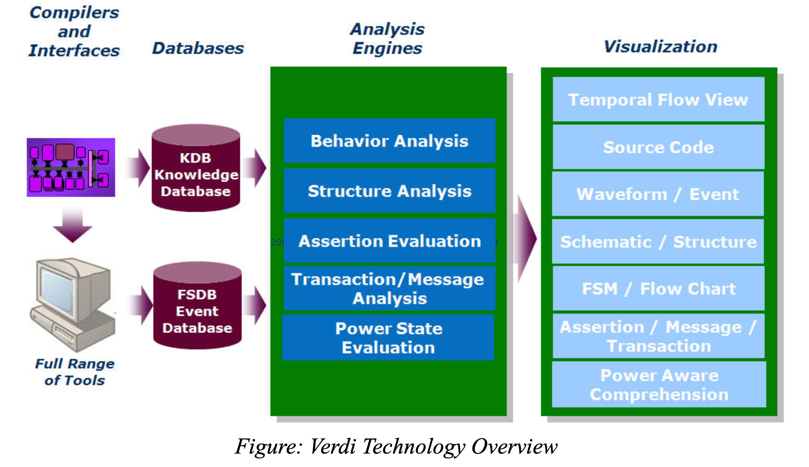

## 总体介绍

Verdi是一个自动调试平台（automated debug platform），用于观察波形、调试 RTL。

### 编译器和接口

- 编译器：Verdi为大多数设计和验证环境中使用的语言提供编译器，如Verilog、VHDL和SystemVerilog以及电源代码（CPF或UPF）。在分析和编译代码时，会检查语法和语义错误。
- 接口：Verdi可以导入其他仿真器生成的标准VCD和SDF数据，并将结果存储在快速信号数据库（Fast Signal Database，FSDB）中。也可以通过对象文件（object files）链接到仿真器（例如VCS）直接生成FSDB。

### 数据库

- 知识数据库（Knowledge Database，KDB）：在编译时，Verdi会识别和提取设计的特定结构、逻辑和功能信息，并将由此产生的详细设计信息存储在KDB中。
- 快速信号数据库（Fast Signal Database，FSDB）：FSDB以高效紧凑的格式存储仿真结果。Synopsys提供可以链接到常见仿真器的对象文件用来直接以FSDB格式存储仿真结果。你也可以通过转换VCD文件的方式生成FSDB。

### 分析引擎

使用来自KDB和FSDB的信息进行分析。

### 可视化

Verdi中有如下的结构可视化和分析工具：

- nTrace：用于源代码
- nWave：用于波形
- nSchema：用于原理逻辑图
- nState：用于有限状态机（FSM）

